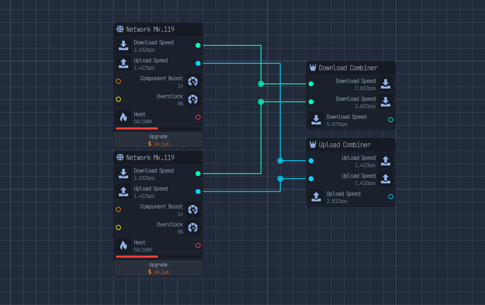

# Network combiner nodes Upload Labs

## Description

Adds two new nodes allowing to combine upload or downloads output into only one input,

## Installation

Add the .zip file from the latest release in your games /mods folder.

## Requirement

You need to have the godot modloader setuped on your game.

More info at [Mod loader self setup](https://wiki.godotmodding.com/guides/integration/mod_loader_self_setup/)
